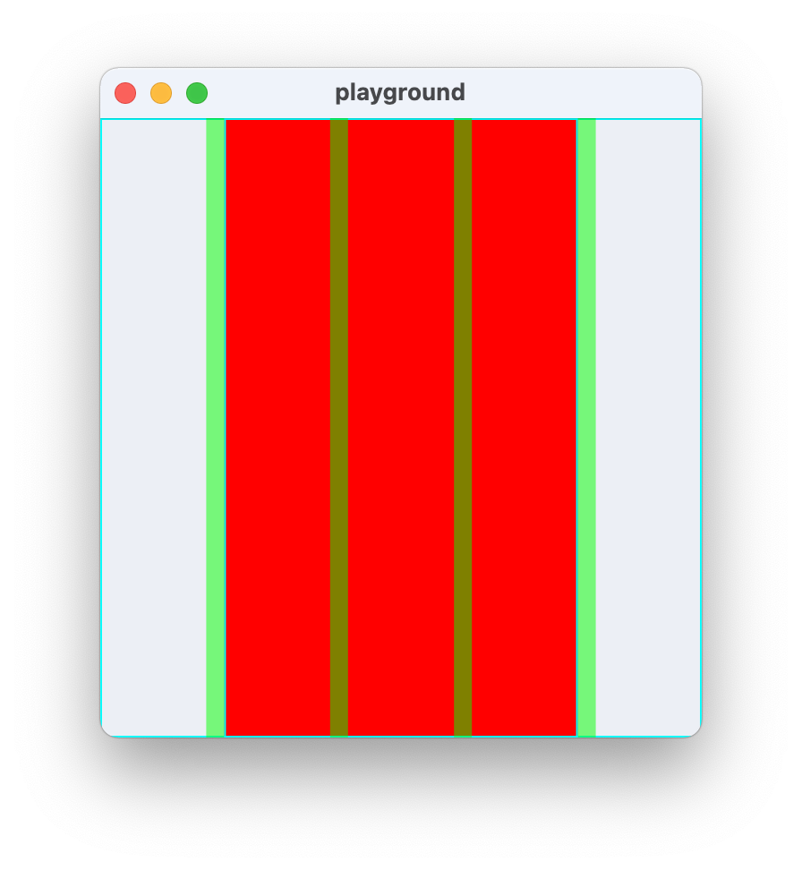
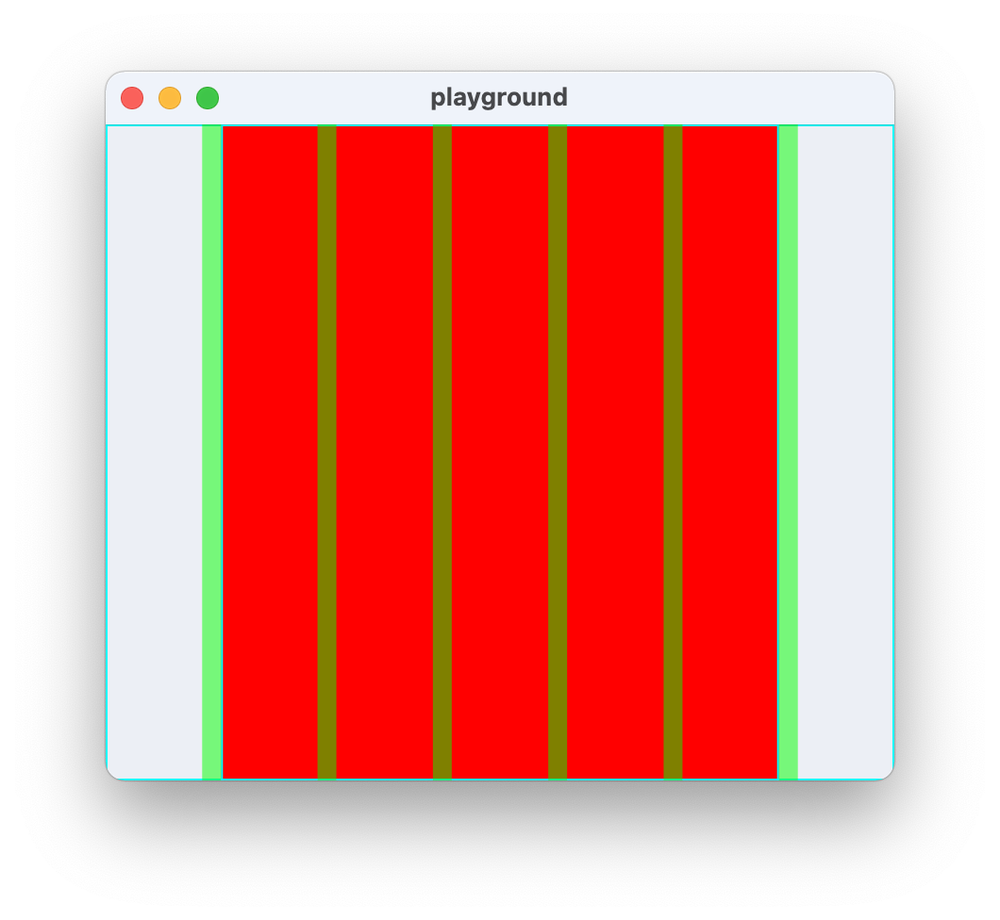

# Grid based layout widgets

While the height in this layout system is still specified by a floating point number,
the widget is specified by an integer denoting the number of columns. The screen is
divided into a fixed number of columns, each spaced by a gutter, and widgets span a
whole number of columns.

Typically, the number of columns depends on screen size.

| Narrow screen                            | Wide screen                          |
| ---------------------------------------- | ------------------------------------ |
|  |  |

See also: https://material.io/design/layout/responsive-layout-grid.html#columns-gutters-and-margins

